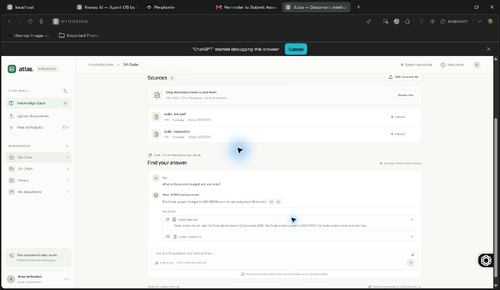

# Atlas verification — 29 September 2026

All four requested RAG flows passed after the fixes below. Verification used
the visible Comet browser, a real NVIDIA NIM connection, and isolated automated
tests. The working app instance is http://127.0.0.1:5175/ with its backend on 8003.

| Requested feature | Result and evidence |
| --- | --- |
| Accept documents at runtime | Passed. The app's Add documents picker uploaded PDF, TXT, Markdown, and DOCX in one batch. Browse files uploaded another PDF/TXT set. All files appeared as Indexed, with document and passage counts. |
| Create a RAG app over uploaded documents | Passed. Orion and Cedar workspaces each built their own searchable index. A DOCX table was extracted and answered correctly. Documents persisted when the launcher started another backend and the browser loaded its page. |
| Answer questions using document evidence | Passed. NVIDIA returned Orion's launch date and $42,000 budget, its 18-month warranty, and a summary of all four sources. Source expanders displayed the supporting excerpts. Cedar returned its different $97,000 budget and 36-month warranty. |
| Support different document sets without code changes | Passed. Workspace switching kept answers, sources, and chat history isolated. Switching while a request was pending did not transfer its answer to the other workspace. Uploading an addendum made extension 6732 immediately queryable without a code change or restart. |

## Failure handling and checks

- A corrupt PDF displayed an actionable error and preserved the existing index.
- Unsupported, empty, oversized, and mixed invalid upload batches were rejected
  by automated tests without adding partial documents.
- An unrelated question declined with no fabricated evidence or citations.
- Document deletion removed its passages; workspace deletion made its ID return
  404. Tests used temporary storage for these checks.
- Live NVIDIA primary-to-backup failover succeeded. The final browser answer
  visibly identified the NVIDIA backup model and cited both Cedar sources.
- Simulated timeouts from both models produced a cited source passage response.
  Empty model responses, absent citations, and invented citation markers were
  rejected in regression tests.
- `python -m unittest tests.test_rag -v`: **16 passed**.
- `npm run build`: **passed**.
- `git diff --check`: **passed**.
- The repeatable live suite, `python tests/verify_live.py --url
  http://127.0.0.1:8003`, passed. Actual generated responses in that run took
  1.05–3.08 seconds. Its synthetic answers and source names are saved in
  [tests/live-results.json](tests/live-results.json).

## Fixes made

- Loaded `.env` and default document storage relative to this project. The
  original page had been connected to a different Atlas copy's backend.
- Added `start.ps1` to choose available ports and pair this project's frontend
  and backend, avoiding the observed port collision.
- Fixed general summary retrieval and common English plural matching.
- Removed a score cutoff that incorrectly rejected relevant queries in a
  workspace containing just one passage.
- Normalized Unicode text and avoided repeatedly tokenizing passages while
  calculating retrieval scores.
- Stored chat histories and pending requests per workspace, keeping delayed
  answers in their originating workspace.
- Kept sidebar order stable while answers update workspace timestamps.
- Added readable input-validation errors, duplicate-request protection, and
  visible labels for NVIDIA backup answers and source-passage responses.
- Required generated answers to contain valid source markers, with source
  excerpts treated as data rather than instructions.

## Scope

The verified formats are text-readable PDF, DOCX, UTF-8 TXT, and Markdown.
Image-only PDFs need OCR, which this project does not implement. Retrieval is
lexical rather than vector-based. General summaries cover up to five sampled
passages, so they are not guaranteed to summarize every page of a long book.
Model availability is external; if both NVIDIA models fail, the app explicitly
shows cited source excerpts rather than claiming that a model generated them.

Synthetic test workspaces were removed after verification. The existing
My documents and Hanjra workspaces were preserved. The screenshot below shows
the successful test before cleanup.

